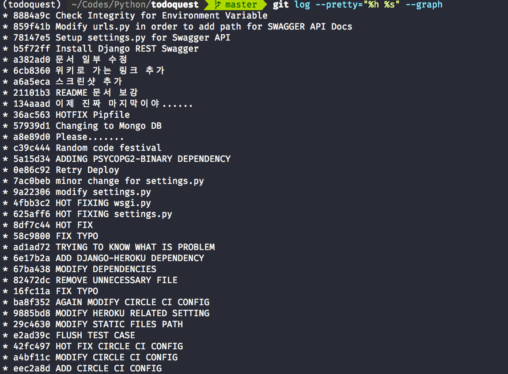

# Git 과제 제출

Git 과제를 수행하기 위해, 윈터코딩 개발과제로 제출했던 [TodoQuest](https://github.com/malkoG/TodoQuest)를 재활용했습니다. 

[블로그](https://kodingwarrior.github.io/post/2018/11/06/Participating-In-Winter-Coding.html)에서 `REST API서버를 구현했음에도 불구하고 Swagger API 문서 생성기를 올리지 못한 것`에 아쉬움을 표현했던 바가 있었는데, 이번 과제를 기회로 삼아 간단하게나마 Swagger API 문서 생성기를 조회할 수 있는 기능을 추가할 수 있었습니다. 다만, Swagger API 문서를 생성할때 프로덕션 환경에서까지 보여지는 문제를 해결해야 합니다.

* `git log` 명령을 수행했을 때 보여지는 깃 커밋 메시지 상세정보 

* `git log --pretty="%h %s" --graph` 명령을 수행했을 때 보여지는 깃 커밋 메시지 요약정보

* 이번 커밋을 통해 추가된 기능(Swagger API)
